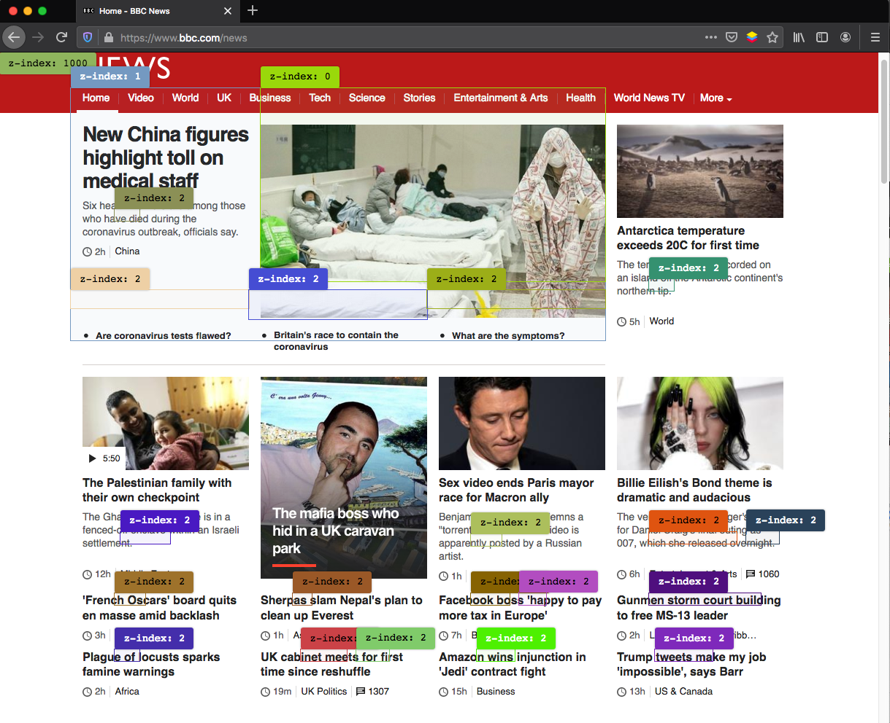

# z-index visualizer

Firefox Add-on to visualize elements with z-index CSS property.

The extension was inspired by a similar tool of the awesome [VisBug](https://github.com/GoogleChromeLabs/ProjectVisBug) Chrome extension. You can also use it as a cross-browser [bookmarklet](https://github.com/georapbox/z-index-visualizer/blob/master/extension/content_scripts/inject-z-index-labels.js).

### Screenshots

